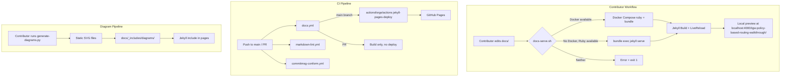

# Design Document

## Overview

This design delivers a GitHub Pages walkthrough site for the
`jajera/tgw-policy-based-routing-walkthrough` repository — the published operator guide for the
runnable lab [`jajera/tgw-policy-based-routing`](https://github.com/jajera/tgw-policy-based-routing).
The implementation adapts the site shell, theme, CI workflows, and diagram pipeline from the
reference repository `jajera/privatelink-conduit`, rebranded for the PBR topic. Terraform remains
in the lab repository; this repository ships docs and CI only.

The system comprises:

1. **Jekyll site** (`docs/`) — 7-page documentation set using the `just-the-docs` gem theme
   with custom `pbr` / `pbr-dark` colour schemes.
2. **Diagram pipeline** — Python script generating static SVG files that use CSS classes
   bound to site custom properties for theme adaptability.
3. **Local preview** — Shell script + Docker Compose (Ruby image + Bundler) with host
   Bundler fallback.
4. **CI workflows** — GitHub Actions for Pages deployment, Markdown lint, and commit message
   conformance, all calling reusable workflows from `actionsforge/actions`.
5. **Repository hygiene** — `.gitignore` files, Dependabot (Actions + Bundler only), lint
   configuration, and authoring notes excluded from published output.

### Design Decisions

| Decision | Rationale |
| --- | --- |
| **Clone Reference_Repository shell, rename only** | Visual/UX parity with [privatelink-conduit](https://jajera.github.io/privatelink-conduit/); do not invent a thinner Overview or alternate chrome |
| Gem-based `theme: just-the-docs` | Matches Reference_Repository; pins version via Gemfile.lock |
| Class / token prefix `pbr-` (from `conduit-`) | Same components (`hero`, `path-grid`, `nav-grid`, theme toggle) with PBR branding |
| Full callout set (`finding`, `note`, `tip`, `warning`, `blocked`, `cost`) | Matches Reference_Repository `_config.yml` callouts |
| Dark scheme does **not** `@import` theme `dark.scss` | Avoids deprecated `lighten`/`darken` (same approach as Reference_Repository) |
| SVG diagrams with CSS classes + site custom properties | Diagrams inherit active colour scheme without duplicated SVG variants |
| Docker Compose with `ruby` image + `bundle exec` | Matches Reference_Repository Gemfile resolution; avoids stale `jekyll/jekyll` image drift |
| `actionsforge/actions` reusable workflows | Centralises CI logic; correct reusable-workflow path used by Reference_Repository |
| Python diagram generator (not Mermaid) | Produces static SVG with full control over CSS classes and accessibility text |
| No Terraform / CDK / CloudFormation trees | Documentation-only scope (Requirements 1, 10, 12) |

## Architecture

### Repository File Tree

```text
tgw-policy-based-routing-walkthrough/
├── .github/
│   ├── dependabot.yml
│   └── workflows/
│       ├── commitmsg-conform.yml
│       ├── docs.yml
│       └── markdown-lint.yml
├── .gitignore
├── .kiro/
│   └── specs/docs-site/
│       ├── .config.kiro
│       ├── requirements.md
│       ├── design.md
│       └── tasks.md
├── .markdownlint.yml
├── docs/
│   ├── .gitignore
│   ├── _config.yml
│   ├── _includes/
│   │   ├── components/
│   │   │   └── aux_nav.html          # theme toggle + aux links
│   │   ├── diagrams/
│   │   │   ├── example-topology.svg
│   │   │   ├── rule-evaluation.svg
│   │   │   ├── inspection-steering.svg
│   │   │   └── troubleshooting-decision.svg
│   │   ├── head_custom.html          # fonts, favicons, early theme apply
│   │   ├── header_custom.html        # optional empty override (parity)
│   │   └── nav_footer_custom.html    # short footer brand line
│   ├── _sass/
│   │   ├── color_schemes/
│   │   │   ├── pbr.scss
│   │   │   └── pbr-dark.scss
│   │   └── custom/
│   │       └── custom.scss
│   ├── assets/
│   │   ├── css/
│   │   │   ├── just-the-docs-pbr.scss
│   │   │   └── just-the-docs-pbr-dark.scss
│   │   └── images/
│   │       ├── favicon.ico
│   │       ├── favicon-16.png
│   │       ├── favicon-32.png
│   │       ├── apple-touch-icon.png
│   │       ├── icon-512.png
│   │       └── og-image.png
│   ├── diagrams/
│   │   └── README.md
│   ├── docker-compose.yml
│   ├── Gemfile
│   ├── Gemfile.lock
│   ├── index.md
│   ├── architecture.md
│   ├── policy-tables.md
│   ├── use-cases.md
│   ├── walkthrough.md
│   ├── troubleshooting.md
│   ├── reference.md
│   ├── walkthrough-brief.md
│   └── scripts/
│       └── generate-diagrams.py
├── LICENSE
├── README.md
└── scripts/
    └── docs-serve.sh
```

### Component Interaction Diagram



### Data Flow

1. **Authoring** — Contributor edits Markdown pages and diagram definitions in
   `generate-diagrams.py`.
2. **Preview** — `scripts/docs-serve.sh` detects runtime, starts Jekyll with live reload.
3. **Commit** — Push triggers CI workflows; lint and commit checks gate merge when configured
   as required status checks on `main`.
4. **Deploy** — Merge to `main` (paths under `docs/` or `docs.yml`) triggers
   `docs.yml` → `actionsforge/actions` `jekyll-pages-deploy` → GitHub Pages at
   `https://jajera.github.io/tgw-policy-based-routing-walkthrough/`.
5. **Reading** — Reader navigates the 7-page site with light/dark toggle; diagrams inherit
   active colour scheme via CSS custom properties.

## Components and Interfaces

### 1. Jekyll Configuration (`docs/_config.yml`)

Centralises site metadata, theme, plugins, navigation, callouts, and build exclusions.
Aligned with Reference_Repository patterns (gem theme, SEO, search, sass quieting).

```yaml
title: TGW Policy-Based Routing
description: >-
  AWS Transit Gateway policy tables — rule-based forwarding using packet attributes.
theme: just-the-docs

url: https://jajera.github.io
baseurl: /tgw-policy-based-routing-walkthrough
permalink: pretty

heading_anchors: true
back_to_top: true
back_to_top_text: "Back to top"

aux_links:
  GitHub: https://github.com/jajera/tgw-policy-based-routing-walkthrough
aux_links_new_tab: true

color_scheme: pbr
favicon_ico: "/assets/images/favicon.ico"

defaults:
  - scope:
      path: ""
    values:
      image: /assets/images/og-image.png

twitter:
  card: summary_large_image

sass:
  quiet_deps: true
  silence_deprecations:
    - import
    - global-builtin
    - color-functions

search_enabled: true
search:
  heading_level: 3
  previews: 3
  preview_words_before: 5
  preview_words_after: 10
  tokenizer_separator: /[\s/]+/
  rel_url: true
  button: false

callouts_level: loud
callouts:
  finding:
    title: Finding
    color: green
  note:
    title: Note
    color: blue
  tip:
    title: Tip
    color: purple
  warning:
    title: Warning
    color: yellow
  blocked:
    title: Not possible today
    color: red
  cost:
    title: Cost
    color: red

footer_content: >-
  Documentation-only repository. AWS feature availability, limits, and behaviour can
  change — verify against current AWS documentation before relying on any claim here.

plugins:
  - jekyll-seo-tag
  - jekyll-include-cache

exclude:
  - Gemfile
  - Gemfile.lock
  - vendor/
  - README.md
  - walkthrough-brief.md
  - docker-compose.yml
  - scripts/
  - diagrams/
```

### 2. Colour Schemes

Palettes are adapted from the Reference_Repository teal/ink network look and renamed for
PBR. Typography uses Sora + Source Sans 3 + IBM Plex Mono (loaded in `head_custom.html`).

**`docs/_sass/color_schemes/pbr.scss`** — Light scheme (illustrative tokens):

```scss
// Light scheme for TGW PBR docs (adapted from Reference_Repository conduit scheme).
$body-background-color: #f3f6f5;
$sidebar-color: #e6eeec;
$border-color: #c9d6d2;

$body-text-color: #1a2b33;
$body-heading-color: #0b1c24;
$nav-child-link-color: #3d5560;

$link-color: #0f766e;
$btn-primary-color: #0f766e;
$base-button-color: #d7e4e0;

$code-background-color: #e8f0ee;
$search-background-color: #ffffff;
$table-background-color: #ffffff;
$feedback-color: #dfe8e5;

$body-font-family: "Source Sans 3", "Source Sans Pro", "Segoe UI", sans-serif;
$mono-font-family: "IBM Plex Mono", "Consolas", "Liberation Mono", monospace;
$heading-font-family: "Sora", "Source Sans 3", sans-serif;
```

**`docs/_sass/color_schemes/pbr-dark.scss`** — Dark scheme (no theme `dark.scss` import):

```scss
// Intentionally does NOT @import just-the-docs dark.scss (deprecated lighten/darken).
$color-scheme: dark;

$link-color: #2dd4bf;
$btn-primary-color: #14b8a6;
$base-button-color: #24343a;

$body-background-color: #0f171a;
$sidebar-color: #121c20;
$border-color: #2a3b42;

$body-text-color: #c5d4d0;
$body-heading-color: #eef5f3;
$nav-child-link-color: #9fb0b6;

$code-background-color: #0a1215;
$search-background-color: #182428;
$table-background-color: #162126;
$feedback-color: #182428;

$body-font-family: "Source Sans 3", "Source Sans Pro", "Segoe UI", sans-serif;
$mono-font-family: "IBM Plex Mono", "Consolas", "Liberation Mono", monospace;
$heading-font-family: "Sora", "Source Sans 3", sans-serif;

@import "./vendor/accessible-pygments/github-dark";
```

**Stylesheet entry points** (`docs/assets/css/`):

```scss
---
---

```

```scss
---
---

```

**Theme toggle** — Port the Reference_Repository includes with rename only:

| File | Role |
| --- | --- |
| `docs/_includes/head_custom.html` | Google Fonts, favicons, early stylesheet swap from `localStorage` key `tgw-pbr-docs-theme` (values `pbr` / `pbr-dark`) before paint — same pattern as Reference `head_custom.html` |
| `docs/_includes/components/aux_nav.html` | Moon/sun toggle (`.pbr-theme-toggle`) + GitHub aux link; `jtd.setTheme()` + `localStorage` — port of Reference `aux_nav.html` |
| `docs/_includes/nav_footer_custom.html` | `.pbr-nav-foot` brand line ("TGW PBR docs") |

System `prefers-color-scheme` is used only when no stored preference exists.

### 3. Custom Styles (`docs/_sass/custom/custom.scss`)

**Port Reference_Repository `docs/_sass/custom/custom.scss` almost verbatim**, renaming
`conduit` → `pbr` and `--conduit-*` → `--pbr-*`. Do not replace it with a minimal hero-only
stylesheet. Required surface (same as [privatelink-conduit](https://jajera.github.io/privatelink-conduit/)):

| Component | Classes |
| --- | --- |
| Tokens | `--pbr-ink`, `--pbr-muted`, `--pbr-accent`, `--pbr-accent-soft`, `--pbr-warn*`, `--pbr-surface`, `--pbr-border`, `--pbr-bg`, `--pbr-sidebar*`, `--pbr-hero-bg`, `--pbr-page-glow-*`, … driven by `$color-scheme` |
| Page chrome | `body` radial glows, `.side-bar` gradient, `.site-title` / heading fonts (Sora) |
| Hero | `.pbr-hero`, `.pbr-kicker`, `.pbr-lede`, `.pbr-actions`, `.pbr-btn`, `.pbr-btn--primary`, `.pbr-btn--ghost` |
| Topic cards | `.path-grid`, `.path-card`, `.path-card__label`, `.path-card__label--warn`, `.path-card__meta` |
| Reading-order cards | `.nav-grid`, `.nav-card` |
| Diagrams | `.diagram`, `.diagram-node`, `.diagram-cluster`, `.diagram-accent`, `.diagram-text`, `.diagram-line`, `.diagram-arrow-head`, … |
| Theme toggle | `.pbr-theme-toggle`, `.pbr-theme-toggle__chip`, moon/sun icon rules |
| Footer chip | `.pbr-nav-foot` |

### 4. Page Set (7 pages)

Each page uses Jekyll front matter with `layout: default`, `title`, and `nav_order`.

**Content pages** (architecture through reference) follow Reference_Repository page chrome:

```markdown
# Title
{: .no_toc }

One-sentence lede.
{: .fs-5 .fw-300 }

## On this page
{: .no_toc .text-delta }

- TOC
{:toc}
```

Diagrams use `<div class="diagram">` + `` (not `<figure>` / ``).

| Page | nav_order | Content Scope |
| --- | --- | --- |
| `index.md` | 1 | Overview shell (below) |
| `architecture.md` | 2 | Example topology, VPCs, TGW, Attachments, Route_Tables vs Policy_Tables |
| `policy-tables.md` | 3 | Match criteria, evaluation order, system/customer entries, limitations |
| `use-cases.md` | 4 | Inspection steering, path selection (DX / VPN), routing-domain isolation |
| `walkthrough.md` | 5 | Numbered CLI walkthrough: create, configure, verify, teardown |
| `troubleshooting.md` | 6 | Failure modes from Requirement 9, symptoms, diagnostics, resolutions |
| `reference.md` | 7 | CLI commands ↔ EC2 API actions, AWS documentation links |

Each content page ends with a primary Next control (just-the-docs `.btn` / `.btn-primary` or
equivalent). The Reference page links back to the Overview page.

Every AWS behavioural claim links to the corresponding `tgw-policy-tables*` (or related)
AWS documentation page.

#### Overview page (`index.md`) — mandatory shell

Match the Reference Overview composition ([live site](https://jajera.github.io/privatelink-conduit/)):

1. **Hero** (`.pbr-hero`) — kicker `jajera · tgw-policy-based-routing-walkthrough`, brand-level
   `<h1>TGW Policy-Based Routing</h1>`, one lede sentence, two CTAs (primary → walkthrough,
   ghost → architecture). First viewport stays brand + lede + CTAs only (no stats strips).
2. **Three uses** (`.path-grid` / `.path-card`) — inspection steering, path selection,
   routing-domain isolation (labels Primary / Secondary as appropriate).
3. **What this covers** — short prose on the pattern + docs-only constraint; `finding` callout
   for availability/pricing with AWS doc link.
4. **Read in this order** (`.nav-grid` / `.nav-card`) — cards for Architecture, Policy tables,
   Use cases, Walkthrough, Troubleshooting, Reference.
5. **Currency** — `note` callout with last-verified date.
6. **Prerequisites in brief** — Terraform / three profiles / Session Manager; link to lab repo
   and Deploy and prove
   deep-dives; must not describe a deployable multi-account lab.
7. **Cost** — `cost` callout for walkthrough TGW charges.

#### Walkthrough outline (`walkthrough.md`)

1. Prerequisites — existing TGW, target Route_Tables, disassociate Route_Table before
   Policy_Table association, required `ec2:*PolicyTable*` IAM actions, region
   `ap-southeast-2`, `cost` callout for TGW charges.
2. Create Policy_Table.
3. Create customer-managed entries (sensitive CIDR → inspection Route_Table; catch-all →
   default Route_Table) with non-consecutive rule numbers.
4. Associate Policy_Table with the Attachment (after Route_Table disassociation).
5. Inspect entries via `get-transit-gateway-policy-table-entries`.
6. Verify expected observations after each state-changing step.
7. Teardown — delete entries, disassociate, delete Policy_Table (and restore prior
   Route_Table association if documented).

All resource IDs use the `EXAMPLE` suffix; CIDRs are RFC 1918. No Terraform/CDK/CFN
instructions. Console alternatives are navigation paths only (no screenshots).

### 5. SVG Diagram System

Diagrams are **inline SVG includes** (not ``). Styling uses CSS **classes** defined in
`custom.scss` that reference `--pbr-*` custom properties — the same pattern as the
Reference_Repository. SVGs do not embed a separate `[data-theme]` stylesheet.

```svg
<svg xmlns="http://www.w3.org/2000/svg" viewBox="0 0 800 400" width="100%"
     role="img" aria-label="Example topology">
  <title>Example topology</title>
  <desc>…</desc>
  <!-- rect/text/line elements use class="diagram-node|diagram-text|diagram-line|…" -->
</svg>
```

Pages wrap includes for layout:

```liquid
<div class="diagram">

</div>
```

Adjacent prose descriptions provide equivalent information for assistive technology.

| File | Used on |
| --- | --- |
| `example-topology.svg` | Architecture |
| `rule-evaluation.svg` | Policy tables |
| `inspection-steering.svg` | Use cases / walkthrough |
| `troubleshooting-decision.svg` | Troubleshooting |

### 6. Diagram Generator (`docs/scripts/generate-diagrams.py`)

**Interface:**

```bash
python3 docs/scripts/generate-diagrams.py
```

**Behaviour:**

- Reads diagram definitions embedded as Python helpers/data within the script (same style
  as Reference_Repository: `box()`, `arrow()`, string-built SVG bodies).
- Writes SVG files to `docs/_includes/diagrams/`.
- Uses deterministic output (fixed coordinates, stable class names, no timestamps or
  random IDs) for byte-identical idempotency.
- Produces four SVG files: `example-topology.svg`, `rule-evaluation.svg`,
  `inspection-steering.svg`, `troubleshooting-decision.svg`.

**Prerequisites:** Python 3.8+ (standard library only; no third-party packages).

`docs/diagrams/README.md` documents the regenerate command, prerequisites, and the file
map above.

### 7. Local Preview Script (`scripts/docs-serve.sh`)

**Interface:**

```bash
./scripts/docs-serve.sh
```

**Logic** (parity with Reference_Repository):

```text
URL = http://127.0.0.1:4000/tgw-policy-based-routing-walkthrough/

IF docker is on PATH THEN
    print "Open ${URL}"
    exec docker compose -f docs/docker-compose.yml up "$@"
ELSE IF bundle is on PATH THEN
    cd docs
    bundle check || bundle install
    print "Open ${URL}"
    exec bundle exec jekyll serve --livereload --watch
ELSE
    print prerequisites (Docker or Ruby+Bundler) on stderr
    exit 1
END
```

### 8. Docker Compose (`docs/docker-compose.yml`)

Uses a Ruby image and the project Gemfile (not the `jekyll/jekyll` image), matching the
Reference_Repository:

```yaml
services:
  docs:
    image: ruby:3.3-bookworm
    working_dir: /srv/jekyll
    ports:
      - "4000:4000"
      - "35729:35729"
    volumes:
      - .:/srv/jekyll
      - docs_bundle:/usr/local/bundle
    environment:
      JEKYLL_ENV: development
      BUNDLE_PATH: /usr/local/bundle
    command:
      - bash
      - -lc
      - |
        set -euo pipefail
        bundle config set --local path /usr/local/bundle
        bundle install
        exec bundle exec jekyll serve \
          --host 0.0.0.0 \
          --port 4000 \
          --livereload \
          --livereload-port 35729 \
          --force_polling \
          --watch

volumes:
  docs_bundle:
```

Compose file lives under `docs/`; bind-mount is the `docs/` directory. After Gemfile
changes, recreate the bundle volume (`docker compose … down -v`).

### 9. GitHub Actions Workflows

Reusable workflows are called from **`actionsforge/actions`** (not standalone
`actionsforge/<name>` repositories).

#### `docs.yml` (Pages Deploy)

```yaml
name: Docs

on:
  push:
    branches: [main]
    paths:
      - 'docs/**'
      - '.github/workflows/docs.yml'
  pull_request:
    paths:
      - 'docs/**'
      - '.github/workflows/docs.yml'
  workflow_dispatch: {}

permissions:
  contents: read
  pages: write
  id-token: write

concurrency:
  group: pages-${{ github.ref }}
  cancel-in-progress: false

jobs:
  pages:
    uses: actionsforge/actions/.github/workflows/jekyll-pages-deploy.yml@main
    with:
      source: docs
      destination: docs/_site
      ruby-version: "3.4"
```

On `main` push: builds and deploys. On PR: builds only (no publish). Path filters avoid
unrelated workflow noise; `workflow_dispatch` allows manual rebuilds.

#### `markdown-lint.yml`

```yaml
name: Markdown Lint

on:
  pull_request: {}

permissions:
  statuses: write
  checks: write
  contents: read
  pull-requests: read

jobs:
  markdown-lint:
    uses: actionsforge/actions/.github/workflows/markdown-lint.yml@main
```

#### `commitmsg-conform.yml`

```yaml
name: Commit Message Conformance

on:
  pull_request: {}

permissions:
  statuses: write
  checks: write
  contents: read
  pull-requests: read

jobs:
  commitmsg-conform:
    uses: actionsforge/actions/.github/workflows/commitmsg-conform.yml@main
```

### 10. Dependabot Configuration (`.github/dependabot.yml`)

```yaml
version: 2
updates:
  - package-ecosystem: github-actions
    directory: /
    schedule:
      interval: weekly
    open-pull-requests-limit: 10
    commit-message:
      prefix: chore
      include: scope
  - package-ecosystem: bundler
    directory: /docs
    schedule:
      interval: weekly
    open-pull-requests-limit: 5
    commit-message:
      prefix: chore
      include: scope
```

No Terraform ecosystem entries.

### 11. Markdown Lint Configuration (`.markdownlint.yml`)

Root-level configuration recording rule exemptions required by the Page Set (for example
`MD013` line length for long CLI commands and AWS URLs; `MD033` only if unavoidable inline
HTML remains after callout migration). Prefer callouts over raw HTML.

### 12. Gemfile (`docs/Gemfile`)

```ruby
source "https://rubygems.org"

gem "jekyll", "~> 4.3"
gem "just-the-docs", "0.12.0"
# Needed for sass.silence_deprecations (theme still on @import / darken)
gem "jekyll-sass-converter", "~> 3.1"

gem "jekyll-seo-tag", "~> 2.8"
gem "jekyll-include-cache", "~> 0.2"

# Required for `jekyll serve` on Ruby 3.0+
gem "webrick", "~> 1.9"
```

Pinned versions committed alongside `docs/Gemfile.lock`.

### 13. Ignore Files

**Root `.gitignore`:**

```gitignore
docs/_site/
docs/.jekyll-cache/
docs/.jekyll-metadata
docs/vendor/
```

**`docs/.gitignore`:**

```gitignore
_site/
.jekyll-cache/
.jekyll-metadata
.sass-cache/
vendor/
```

(Optional parity excludes such as `LICENSE` / `README.md` under `docs/` are unnecessary
when those files are not placed there.)

### 14. Root README

Documentation-only pointer (≤ 200 lines):

1. First paragraph: published walkthrough for `jajera/tgw-policy-based-routing`; Terraform lives
   in the lab repo (this repo provisions no AWS resources).
2. Link to the lab repository and the published Pages URL.
2. ≤ 5-sentence PBR summary.
3. Link to published site URL.
4. Table of Page_Set pages with one-line descriptions and published URLs.
5. Local preview: `./scripts/docs-serve.sh`.
6. Note that Markdown lint and commit-conform checks must be required status checks on
   `main`.
7. Must not describe the repository as a deployable lab, sandbox, or Terraform project.

### 15. Authoring Brief (`docs/walkthrough-brief.md`)

Internal notes for walkthrough authoring (rule numbers, EXAMPLE IDs, teardown order).
Excluded from Jekyll output. May also restate required status-check setup for maintainers.

## Data Models

This feature has no runtime data storage. The "data" is the static content and
configuration that Jekyll transforms at build time.

### Page Front Matter Schema

```yaml
---
layout: default          # Required — always "default"
title: <string>          # Required — page title shown in nav and <title>
nav_order: <integer>     # Required — 1-7, determines left-nav position
description: <string>    # Optional — used by jekyll-seo-tag for meta description
---
```

### Diagram Generator Helpers

The generator follows the Reference_Repository style (functions + string bodies) rather
than a heavy object model. Conceptual shapes:

| Concept | Fields | Notes |
| --- | --- | --- |
| Box | x, y, w, h, lines[], kind | `kind` ∈ {`node`, `cluster`, `accent`} → CSS class |
| Arrow | x1, y1, x2, y2, label?, dashed? | Uses shared `marker` id `arrow` |
| SVG doc | width, height, body, title | Emits `<title>`, `role="img"`, `aria-label` |

Determinism rules: no timestamps, no UUIDs, stable attribute order in emitted markup,
fixed coordinates.

### Policy Table Entry (Content Model — for documentation accuracy)

The following model represents the AWS concepts documented in the Page Set. It is
not implemented as code but drives the content structure of `policy-tables.md`:

| Field | Type | Notes |
| --- | --- | --- |
| Rule Number | int (1–50,000) or `*` | `*` = system-managed |
| Source CIDR | CIDR or Any | Omitted → Any |
| Destination CIDR | CIDR or Any | Omitted → Any |
| Source Port Range | port range or Any | Meaningful for TCP/UDP only |
| Destination Port Range | port range or Any | Meaningful for TCP/UDP only |
| Protocol | 1, 6, 17, 47, `*` | ICMPv4, TCP, UDP, GRE, Any |
| Target Route Table | Route Table ID | Forwarding destination |
| Entry Type | system-managed \| customer-managed | Read-only vs editable |

Evaluation order: system-managed entries → customer-managed ascending rule number → implicit deny.

## Error Handling

### Preview Script Errors

| Condition | Behaviour |
| --- | --- |
| Docker unavailable, Bundler unavailable | Print error naming both prerequisites; exit 1 |
| Docker Compose service fails to start | Docker Compose propagates error; non-zero exit |
| `bundle install` fails | Bundler error output shown; script exits non-zero |
| Port 4000 already in use | Jekyll/Docker error surfaces; user must free the port |

### CI Workflow Errors

| Condition | Behaviour |
| --- | --- |
| Jekyll build failure | `docs.yml` job fails; previously published site remains live |
| Markdown lint violation | `markdown-lint.yml` fails; reports file path + rule ID |
| Commit message non-conformance | `commitmsg-conform.yml` fails; reports offending commit |
| Reusable workflow unreachable | GitHub Actions reports fetch failure; job fails |
| Triggered run skips build unexpectedly | Reusable workflow / job concludes failed (Requirement 5) |

### Diagram Generator Errors

| Condition | Behaviour |
| --- | --- |
| Python < 3.8 | Script fails with syntax/runtime error |
| Output directory missing | Script creates `docs/_includes/diagrams/` if absent |
| Write permission denied | Python raises `PermissionError`; script exits non-zero |

## Testing Strategy

### Why Property-Based Testing Does Not Apply

This feature consists of:

- Declarative configuration (YAML, SCSS, Gemfile)
- Static content (Markdown pages, SVG files)
- Shell scripting (preview launcher)
- CI workflow definitions (YAML)
- A Python script with deterministic output

There are no pure functions with large input spaces, no parsers or serializers processing
user-provided data, and no business logic transformations. The diagram generator operates
on fixed internal data structures (not user input). PBT is not appropriate here.

### Test Approach

#### 1. Integration Tests (CI-verified)

| What | How |
| --- | --- |
| Jekyll builds without errors | `docs.yml` workflow runs Jekyll build on every PR touching `docs/` |
| Markdown conforms to lint rules | `markdown-lint.yml` reports violations |
| Commit messages conform | `commitmsg-conform.yml` checks PR commits |
| Front matter validity | Jekyll build with strict front matter as configured in the reusable workflow |

#### 2. Smoke Tests (Manual / Script-verified)

| What | How |
| --- | --- |
| Preview script works with Docker | Run `./scripts/docs-serve.sh`; open site at baseurl path |
| Preview script Bundler fallback | Without Docker; run script; verify serve or clear prerequisite error |
| Colour scheme toggle | Toggle in header; confirm `localStorage` key `tgw-pbr-docs-theme` and persistence |
| Diagrams render in both themes | Toggle themes; confirm SVG class fills/strokes update |

#### 3. Idempotency Test (Diagram Generator)

```bash
python3 docs/scripts/generate-diagrams.py
cp docs/_includes/diagrams/*.svg /tmp/run1/
python3 docs/scripts/generate-diagrams.py
diff -r docs/_includes/diagrams/ /tmp/run1/
# Expect: no differences
```

#### 4. Content Accuracy Review

Manual verification that:

- Policy table mechanics match AWS documentation
- CLI commands match current `aws ec2` subcommand syntax
- Limitations and failure modes in Requirement 9 are accurately documented
- All AWS documentation links resolve
- Walkthrough includes disassociate-before-associate and `cost` callout

#### 5. Accessibility Checks

- Every SVG has `<title>` (and `<desc>` where useful) plus `role="img"` / `aria-label`
- Every diagram has adjacent text description in the page
- Colour contrast ratios meet WCAG 2.1 AA in both schemes
- Site navigation is keyboard-accessible (just-the-docs default behaviour)
- Theme toggle button exposes updated `aria-label` / `title` for current mode

#### 6. Repository Shape Validation

```bash
# Zero IaC files
find . \( -name '*.tf' -o -name '*.tf.json' -o -name '*.tfvars' \
  -o -name 'template.yaml' -o -name 'template.yml' \
  -o -name '*.cfn.yaml' -o -name '*.cfn.yml' -o -name '*.cfn.json' \
  -o -name 'cdk.json' -o -name 'cdk.context.json' \) | wc -l
# Expect: 0
```

## Requirements Traceability

| Requirement | Design coverage |
| --- | --- |
| 1 Documentation-only shape | File tree; ignore files; repo shape test; no IaC decision |
| 2 Root README | Component 14 |
| 3 Site shell / theme | Components 1–3; colour schemes; toggle; assets; search/SEO |
| 4 Local preview | Components 7–8; Gemfile |
| 5 Pages deploy | Component 9 `docs.yml`; `_config.yml` exclude |
| 6 Page set / reading order | Component 4 |
| 7 Diagrams | Components 5–6 |
| 8 Policy table mechanics | Content model; `policy-tables.md` scope |
| 9 Limitations / failure modes | `policy-tables.md`, `use-cases.md`, `troubleshooting.md` scopes |
| 10 Walkthrough | Walkthrough outline in Component 4 |
| 11 Hygiene workflows | Components 9–11; Dependabot; README status-check note |
| 12 Authoring / non-goals | Component 15; Overview non-goals; exclude list; `.kiro/specs/` retained |
